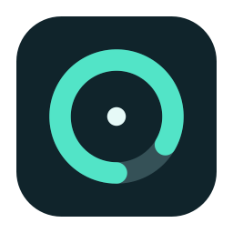

# QuotaBar

**Your OpenAI and Anthropic allowances, right in your Mac’s menu bar.**

See how much usage is left, hover to find out when it resets, and get back to work. QuotaBar is a native Mac app that uses your existing local sign-ins through Codex and Claude Code.

[**Download the latest release**](https://github.com/quantumisai/macaiusage/releases/latest) · [Report a bug](https://github.com/quantumisai/macaiusage/issues) · [MIT license](LICENSE)

## What it shows

- Separate OpenAI (`O`) and Anthropic (`A`) remaining or used percentages beside your other menu bar icons.
- Compact readings such as `O13% A0%`, with system menu bar colors and stable width. Full provider names and stale status appear on hover and in the panel.
- One running instance per user, even if you open a second copy. Reopening shows the existing usage window.
- Reset countdowns and exact reset times in your local time zone.
- Every window reported by the main Codex quota, such as session or weekly usage.
- Automatic account following when you change the shared local Codex sign-in used by Conductor, with the account email shown in the panel and hover details.
- Configurable refresh frequency, display style, panel warning threshold, and launch at login.

**This tracks Codex and Claude subscription allowances, not API spending or every ChatGPT model/message limit.** Available windows depend on the account: a weekly limit can appear without a separate session limit. QuotaBar never invents a missing allowance.

## Install

### 1. Check the requirements

- **macOS 14 Sonoma or later**, on Apple Silicon or Intel.
- **Codex CLI installed**, with support for `codex app-server`. Codex CLI 0.135.0 is supported.
- **A ChatGPT account with Codex access**, signed in through Codex. A Pro account works; API-key billing is a different usage system.

If you do not have Codex yet, follow [OpenAI’s Codex CLI installation instructions](https://developers.openai.com/codex/cli), then return here. Standalone and npm installations are supported; npm installations also require Node to remain installed. QuotaBar supplies the standard Homebrew, npm, and selected executable directories to its Codex subprocess, so it can start from Finder or at login without opening Terminal. QuotaBar does not bundle the CLI. You do **not** need Xcode, Swift, or an API key to use the downloaded app.

### 2. Download and open QuotaBar

1. Open the [latest release](https://github.com/quantumisai/macaiusage/releases/latest).
2. Download **`QuotaBar-v1.2.2-universal.zip`** from **Assets**. This one download contains Apple Silicon and Intel versions. GitHub’s “Source code” archives are for building the app yourself.
3. Double-click the ZIP to extract **QuotaBar.app**.
4. Move **QuotaBar.app** to **Applications**, or your personal **`~/Applications`** folder, before enabling launch at login.
5. Open the app. Look for its percentage or gauge icon in the **top-right menu bar**. It does not create a Dock icon.

**First-open notice:** this release is locally signed, but it is **not Apple-notarized or signed with a Developer ID certificate**. macOS may block it on the first open. If you downloaded this repository’s release and choose to trust it, try opening it, then use **System Settings → Privacy & Security → Open Anyway** for QuotaBar. See [Apple’s explanation and instructions](https://support.apple.com/en-us/102445). You can also [build from source](#build-from-source).

Optional: download `SHA256SUMS.txt` from the same release into the folder containing the ZIP, then verify the download in Terminal:

```sh
shasum -a 256 -c SHA256SUMS.txt
```

### 3. Connect your account

If you already use Codex with your ChatGPT account, QuotaBar picks up that sign-in automatically. Otherwise:

1. Click QuotaBar’s menu bar icon.
2. Click **Connect ChatGPT**.
3. Finish signing in in your browser. QuotaBar updates after the connection completes.

Alternatively, sign in from Terminal, then click QuotaBar’s refresh button:

```sh
codex login
```

Choose your **ChatGPT account**, rather than an API key. Sign-in is shared with the local Codex CLI; connecting a different account also changes the account that CLI uses.

### Using two accounts with Conductor

QuotaBar automatically follows the **shared local Codex sign-in** used by Conductor. Sign in to your other account in Conductor or Codex, then look at the email in QuotaBar’s panel or **Settings → Conductor / Codex** to confirm which account the allowance belongs to. You do not need to connect each account separately in QuotaBar.

Changes to the local sign-in are checked every five seconds, independently of the usage refresh interval. QuotaBar clears the previous account’s numbers while fetching the new allowance. Every scheduled or manual refresh also opens a fresh Codex connection, so accounts stored in the macOS Keychain are picked up at the next refresh. Click the refresh arrow to check immediately.

This follows the saved account in the same Codex home, normally `~/.codex`; it does not select an account based on the focused Conductor workspace. Existing agent sessions may retain their previous sign-in until reconnected. Separate per-workspace `CODEX_HOME` profiles and Conductor cloud credentials are not automatically discovered. If QuotaBar is launched with `CODEX_HOME`, it uses that home for both Codex and account-change detection.

### Add Anthropic / Claude usage

Claude usage is enabled by default. Install **Claude Code 2.1.280 or later** and sign in with your Claude subscription (`claude auth login`), then click QuotaBar’s refresh arrow. If you already use a recent bundled Claude in Conductor, QuotaBar discovers it automatically. See [Claude Code setup](https://code.claude.com/docs/en/setup).

The menu bar shows **`O 51%  A 84%`**, for example: OpenAI and Anthropic allowance remaining. Click it for separately labelled provider sections. Scroll down for Claude’s session, weekly, and any model-specific weekly limits. Hover to see both providers’ reset times. Claude accounts may report a zero-used window with no reset timestamp until that window starts; QuotaBar shows the percentage and says the reset time is unavailable.

In **Settings → Anthropic / Claude**, disable **Show Anthropic usage** to return to the Codex-only display. Leave the executable blank to detect Conductor’s newest bundled Claude first, then `~/.local/bin`, Homebrew, npm, and PATH installations. Use the executable field and **Apply** to select a different installation.

Claude refreshes independently on the configured interval and after wake. Each check starts a fresh Claude process to pick up its current local sign-in; use **Refresh** immediately after changing accounts. It inherits `CLAUDE_CONFIG_DIR` if QuotaBar was launched with one, but does not discover separate workspace profiles or cloud credentials. Opening the web dashboard uses your browser’s account, which may differ from Claude Code’s.

The Claude integration uses the **experimental `get_usage` control request**, exposed by [Anthropic’s SDK](https://github.com/anthropics/claude-agent-sdk-typescript/releases/tag/v0.3.169). This interface may change; update Claude Code and QuotaBar if it stops working. API-key/provider sessions without subscription limits show unavailable, not 100% remaining.

## Use it

**At a glance:** the menu bar shows the percentage remaining by default. For each provider, QuotaBar follows the available window with the least allowance left, including any returned Claude model-specific weekly window.

**Hover:** leave the pointer over the icon briefly to see the standard macOS tooltip with usage and reset details.

**Click:** open the usage panel to see the returned quota windows, progress bars, exact reset times, and the last successful refresh. Use the refresh arrow to update immediately, the gear for settings, or **Open usage dashboard** to visit Codex’s usage page.

### Settings

| Setting | Options / behavior |
| --- | --- |
| Display | Percent remaining, percent used, session + weekly remaining, or icon only. When showing both, session is first and weekly is second. |
| Track | Session, weekly, or lowest remaining. Applies to a single percentage display. |
| Show Anthropic usage | Show or hide the separate `A` number and Claude section. Enabled by default. |
| Claude executable | Automatic detection, or an absolute path to a current Claude Code executable; click **Apply**. |
| Show usage details on hover | Enable or disable the menu bar tooltip. |
| Reset time | Countdown, date and time, or both. Times use your Mac’s local time zone. |
| Refresh every | 1, 2, 5, or 15 minutes. Default: 2 minutes. |
| Warn below | Turn usage indicators orange in the panel when remaining allowance reaches the threshold. The menu bar keeps its system color; no notifications are sent. |
| Launch QuotaBar at login | Start in the menu bar when you sign in to your Mac. Disabled until you enable it. |
| Codex executable | Leave blank for automatic detection, or enter a full executable path and click **Apply**. |

Settings are saved automatically, apart from the executable change, which takes effect when you click **Apply**.

### Reading unavailable or old data

- **`—`** means a selected window was not returned, or its reset time passed and fresh usage has not arrived yet.
- **A dot after the percentage** and an update notice mean the app is displaying the last known reading.
- **Reset due / awaiting update** means the countdown ended. QuotaBar waits for the service to confirm the new allowance instead of assuming it is back to 100%.

The app also refreshes after your Mac wakes up. It does not need to send an AI prompt to check usage.

## Troubleshooting

| Problem | What to do |
| --- | --- |
| “Codex CLI was not found” | Install the CLI, then refresh. If it is installed in a custom location, run `command -v codex` in Terminal and paste that full path into **Settings → Advanced → Codex executable**, then click **Apply**. |
| Disconnected after restarting your Mac | Update to **1.0.1 or later**, then open QuotaBar and refresh. Version 1.0.0 could fail to locate Node when started at login; your Codex sign-in may still be valid. |
| Codex works in Terminal but not QuotaBar | For a custom Node version-manager installation, set **Codex executable** to the full path returned by `command -v codex`, normally beside its Node executable. Alternatively, use the standalone native CLI from OpenAI’s instructions. |
| Signed in, but no subscription usage | Make sure Codex is signed in with ChatGPT rather than an API key. Use **Connect ChatGPT** or **Reconnect ChatGPT**, or run `codex login`, then refresh. |
| Usage belongs to my other account | Check the email in QuotaBar, finish changing the shared local Codex sign-in in Conductor, then click Refresh. QuotaBar 1.1.0 or later follows account changes automatically. Separate Codex homes do not share a sign-in. |
| Claude number shows `—` | Open the panel for its error. Sign in with a subscription in Claude Code and refresh. Update to Claude Code 2.1.280 or later; API keys do not supply subscription allowances. |
| Only a weekly limit appears | That is what the service returned. Keep **Track → Lowest remaining** or choose **Weekly**. A missing session limit is shown as `—`. |
| Refresh fails or times out | Check your internet connection and try refreshing. If it persists, update Codex and sign in again. Last known values are marked as stale. |
| The whole icon disappears, including at zero usage | Update to **1.2.1 or later**. Its width stays stable as readings change. macOS can still hide items when the menu bar is crowded; reopen QuotaBar from Applications or Spotlight to show its usage in a regular window. Choose **Icon only** in Settings if space is tight. |
| No Dock icon | QuotaBar normally lives in the menu bar. Reopening the app shows its usage window; closing that window keeps monitoring active. |
| Launch at login needs approval | Keep the app in Applications, then allow QuotaBar in **System Settings → General → Login Items** if macOS requests approval. |
| macOS blocks the download | Read the first-open notice above. The initial release is not notarized. |

If something still fails, [open an issue](https://github.com/quantumisai/macaiusage/issues) with your macOS version, chip type, QuotaBar version, `codex --version`, and the visible error. Do not include passwords, API keys, authentication files, or private account information.

## Update or uninstall

**Update:** choose **Quit** in QuotaBar, download the next release, and replace the app in the same Applications folder. Open the replacement. Display preferences are retained. There is no automatic updater.

**Uninstall:** turn off **Launch QuotaBar at login**, quit the app, then move QuotaBar.app to the Trash. This does not sign you out of Codex or remove Codex itself.

## How it works and privacy

For OpenAI, QuotaBar starts the installed Codex CLI’s [documented app-server interface](https://learn.chatgpt.com/docs/app-server) and communicates over local standard input/output. It reads `account/read` and `account/rateLimits/read`; choosing **Connect ChatGPT** starts the CLI’s browser login flow. The CLI handles authentication and the request to OpenAI.

For Anthropic, QuotaBar starts the installed Claude Code CLI in safe mode with tools, customizations, MCP servers, and session persistence disabled. It sends only initialization and usage control requests, asks Claude to skip transcript analysis, and ends the process after each check. Claude Code handles its own authentication and service request. QuotaBar does not extract Claude credentials or call authenticated Anthropic endpoints directly.

QuotaBar does not read or copy the contents of token files, passwords, or API keys. It checks only file metadata for `auth.json` and `config.toml` to notice changes to the shared sign-in. The account email returned by Codex is displayed to distinguish accounts; email and usage stay in memory and are not saved or logged by QuotaBar. It has no analytics SDK or separate backend. Display preferences are saved in macOS user defaults. It does not create conversations or send model prompts to refresh usage. The CLIs retain their own authentication and service data handling.

QuotaBar is an independent project, not affiliated with or endorsed by OpenAI or Anthropic.

## Build from source

Building requires **Swift 6.2 or later** and the macOS SDK, provided by a recent Xcode or Apple Command Line Tools. No third-party Swift packages are required.

```sh
git clone https://github.com/quantumisai/macaiusage.git
cd macaiusage
./scripts/run.sh
```

This builds `dist/QuotaBar.app` for your Mac, signs it locally, and opens it. Other commands:

```sh
./scripts/build-app.sh            # Build without opening
./scripts/install.sh              # Build, copy to ~/Applications, and open
./scripts/test.sh                 # Run the tests
./scripts/package-release.sh      # Build and package the universal release
```

The test script supplies Swift Testing framework paths when a Command Line Tools installation needs them; with full Xcode it runs `swift test` normally. It forwards arguments, such as `./scripts/test.sh --filter UsageModelsTests`.

`Sources/UsageCore` contains quota models, formatting, account-change detection, and the Codex connection. `Sources/QuotaBar` contains AppKit menu bar integration and SwiftUI views. Tests cover quota selection, reset boundaries, stale readings, subprocess protocol/error handling, and account switching during an active refresh. The icon is drawn by `scripts/generate-icon.swift`.

Contributions are welcome through pull requests. Run `./scripts/test.sh` and `./scripts/build-app.sh` before submitting a change. Code is available under the [MIT license](LICENSE).
